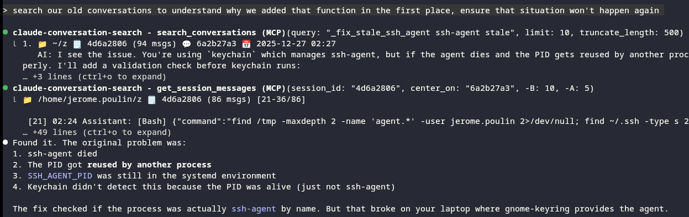

# Claude Code Conversation Search

**CLI + MCP tool for searching Claude Code conversation history.**

A single binary that works two ways:
- **CLI**: Search your conversations from the terminal (`claude-conversation-search search "rust async"`)
- **MCP Server**: Lets Claude search its own history during sessions (the only tool that does this!)

Other tools (claude-history-explorer, claude-code-history-viewer, etc.) are *viewers* - you browse manually. This tool indexes everything with Tantivy/BM25 and gives both you AND Claude direct search access.



*Claude searching its own history to understand why a function was added, then jumping to the exact message with `center_on` and `-B/-A` context.*

## Perfect For Heavy Claude Code Users

If you work across **dozens of projects**, you know the pain:
- "I solved this exact problem last month... but which project?"
- "What was that regex pattern I used for parsing logs?"
- "How did I configure that Docker setup?"

This tool indexes **all your conversations across all projects** and lets Claude search them instantly. No more digging through folders or re-explaining context.

> **Warning**: Claude Code auto-deletes old conversations! Check `~/.claude/settings.json` for `cleanupPeriodDays` - this deletes conversations older than N days (0 = immediate deletion!). Set it to `999999999` to keep your history.

## Why This Tool?

| Feature | This Tool | Other Tools |
|---------|-----------|-------------|
| Claude can search its own history | ✓ MCP integration | ✗ Manual browsing only |
| Cross-project search | ✓ All projects indexed | ✗ Per-project only |
| Full-text search | ✓ Tantivy/BM25 | Some have regex |
| Jump to specific message | ✓ `center_on` + `-B/-A` context | ✗ |
| Smart content filtering | ✓ Skips tool_result noise | ✗ Index everything |
| Passive staleness detection | ✓ Warns when index outdated | ✗ |

## Overview

Claude Code stores conversations as JSONL files in `~/.claude/projects/`. This tool indexes them with smart filtering (skips file dumps, keeps reasoning) and exposes search via MCP so Claude can find relevant past conversations during your session.

## Features

### 🔍 **Powerful Search**
- **Full-text search** across all conversations with BM25 ranking
- **Smart filtering** by project name
- **Highlighted snippets** showing matched content in context
- **Relevance scoring** for best matches first

### ⚡ **High Performance**  
- **Lightning fast**: Sub-millisecond search queries
- **Efficient indexing**: Processes thousands of conversations in seconds
- **Memory efficient**: Uses memory-mapped indexes via Tantivy

### 🔧 **Unified Interface**
- **Single binary** with subcommands for both CLI and MCP server functionality
- **CLI mode**: Simple command-line interface for terminal usage (`claude-conversation-search search ...`)
- **MCP server mode**: Integration with Claude Code via Model Context Protocol (`claude-conversation-search mcp`)
- Configurable result limits and project-based filtering

### 🎯 **Smart Features**
- **Auto-discovery** of Claude Code directories (`~/.claude/projects/`)
- **Smart content filtering**: Indexes text/thinking blocks, skips tool_result file dumps (noise reduction)
- **UUID-based deduplication**: Handles session resume and rollbacks gracefully
- **Passive health monitoring**: Warns when index is stale, offers reindex tool
- **Robust parsing** handles malformed JSONL gracefully

## Quick Start

### Debian / Ubuntu

Packages for amd64 and arm64 are served from [apt.ticpu.net](https://apt.ticpu.net). This is a single portable binary, so the `generic` suite works on any Debian or Ubuntu — the per-codename suites (bookworm, trixie, noble, resolute) carry the same packages.

```bash
curl -fsSLO https://apt.ticpu.net/ticpu-archive-keyring.deb
sudo dpkg -i ticpu-archive-keyring.deb
echo 'deb [signed-by=/usr/share/keyrings/ticpu-archive-keyring.gpg] https://apt.ticpu.net generic main' | sudo tee /etc/apt/sources.list.d/ticpu.list
sudo apt update && sudo apt install claude-conversation-search
```

The package ships the binary and bash/zsh/fish completions. Registering the MCP server with Claude Code stays a user action — run `claude-conversation-search install` afterwards.

### One-Line Install

```bash
git clone https://github.com/ticpu/claude-conversation-search-mcp
cd claude-conversation-search-mcp
cargo run --release -- install
```

The installer registers the binary with Claude Code MCP.

Verify: `claude mcp list` should show `claude-conversation-search`.

### Manual Installation

```bash
cargo build --release
cp target/release/claude-conversation-search ~/.local/bin/
claude mcp add claude-conversation-search ~/.local/bin/claude-conversation-search mcp
```

### Basic Usage

```bash
# Index your conversations (run this first time)
claude-conversation-search index

# Search for anything
claude-conversation-search search "kubernetes"
claude-conversation-search search "error handling" 
claude-conversation-search search "rust async"

# Search with project filter
claude-conversation-search search "rust" --project "vault-rs"

# Limit number of results
claude-conversation-search search "function" --limit 20
```

## CLI Reference

### `claude-conversation-search index [status|rebuild|vacuum]`
Manage the search index. `status` (the default, run with no subcommand) prints the lock state
and, if an index exists, its path, file/entry counts, last-updated time and size:

```
Index Status
============
Lock Status: Available
Index Path: /home/user/.cache/claude-conversation-search
Total Files: 15
Total Entries: 2847
Last Updated: 2025-08-23 15:30:00 UTC
Index Size: 12.40 MB
```

`rebuild` clears the cache and re-indexes every JSONL file under `~/.claude/projects/` from
scratch, printing `Index rebuild completed successfully.` when done. `vacuum` is currently the
same rebuild under a different name. Every other command (`search`, `topics`, `stats`, `session`,
`summary`) auto-indexes first when `index.auto_index_on_startup` is true (the default), so running
`index` explicitly is only needed to check status or force a rebuild.

### `claude-conversation-search search <query>`
Search through your indexed conversations.

```bash
claude-conversation-search search "rust async functions"
claude-conversation-search search "error" --project "my-project" --limit 5
```

**Options:**
- `--project <name>` - Filter by project directory name
- `--session <id>` - Filter by session ID (prefix match)
- `--limit <n>` - Maximum results (default: 10)
- `-C <n>` / `-B <n>` / `-A <n>` - Context messages before/after the match, grep-style (default: 2)
- `--exclude-project <name>` - Repeatable; drop results from these projects
- `--exclude-pattern <regex>` - Repeatable; drop results matching a regex
- `--sort <relevance|date-desc|date-asc>` - Result order (default: relevance)
- `--after <date>` / `--before <date>` - Filter by date (YYYY-MM-DD or ISO 8601)
- `--include <thinking|tools>` - Repeatable; show thinking blocks and/or tool calls (hidden by default)
- `--truncate <n>` - Characters shown per message around the match; 0 for full content (default: 300)

**Expected output:**
```
Found 3 results (-C 2):

1. 📁 ~/GIT/my-project 🗒️ abc123de (12 msgs) 💬 f4a9e21c 📅 2025-08-23 15:30
🎟️rust,async
   User: how do I handle async functions in Rust
»  AI: Here's how to handle async functions in Rust: async fn process_data() -> Result<(), Error> { ... }
   User: thanks, what about tokio::spawn
```

**Query features** (Tantivy's default query syntax):
- **Simple/multiple terms**: `claude-conversation-search search "rust error handling"`
- **Phrase search**: `claude-conversation-search search '"exact phrase"'`
- **Boolean AND/OR**: `claude-conversation-search search "rust AND async"`
- **Field syntax**: `claude-conversation-search search "project:vault-rs"` or `"session_id:abc123"`

### `claude-conversation-search session <session_id>`
View a session's messages directly.

```bash
claude-conversation-search session abc123de              # first page, 5 messages of context
claude-conversation-search session abc123de --full       # untruncated content
claude-conversation-search session abc123de --center <msg_uuid> -C 10
claude-conversation-search session abc123de --offset 50 --limit 20
```

**Options:**
- `--full` - Show full content instead of truncated snippets
- `--center <uuid>` - Center the view on a message UUID (prefix match); overrides offset/limit
- `-C <n>` / `-B <n>` / `-A <n>` - Messages before/after the center (default: 5)
- `--truncate <n>` - Characters shown per message; 0 for full content (default: 200)
- `--offset <n>` - Skip this many messages before displaying (default: 0)
- `--limit <n>` - Messages to show; 0 for all (default: 0)

Reads the source JSONL directly when it exists (untruncated content), falling back to the search
index otherwise; the header marks it `(from index, content may be truncated)` when it does. Exits
with a non-zero status and an error on stderr if the session has no displayable messages.

### Other commands
- `topics [--project <name>] [--limit <n>]` - Ranked technologies, languages, tools and projects across indexed conversations
- `stats [--project <name>]` - Cache and conversation statistics
- `summary <session_id>` - Summarize a session by piping it to `claude --print --model haiku` in a jailed empty directory
- `cache info` / `cache clear` - Inspect or clear the on-disk index
- `install [--project]` - Register this binary as an MCP server with Claude Code (user scope by default)
- `completions <shell>` - Generate shell completions

## MCP Integration (Claude Code)

This tool also provides an MCP (Model Context Protocol) server for seamless integration with Claude Code.

### Setup

1. **Build the binary** (if not already done):
   ```bash
   cargo build --release
   ```

2. **Configure Claude Code** using the MCP CLI:
   ```bash
   # Add the MCP server to Claude Code
   claude mcp add claude-conversation-search /path/to/claude-conversation-search mcp
   
   # Alternatively, if installed globally:
   claude mcp add claude-conversation-search claude-conversation-search mcp
   
   # Verify it was added successfully
   claude mcp list
   ```

   This configures Claude Code to use `claude-conversation-search mcp` as an MCP server named "claude-conversation-search".

3. **Use within Claude Code** - Claude will automatically have access to search your conversations:
   - "Search my previous conversations about Rust async"
   - "Find where we discussed error handling"
   - "Summarize that long session from last week"

### MCP Tools Available
- **search_conversations**: Full-text search with `-C`/`-B`/`-A` context (grep-style). Shows timestamps, session IDs, 🎟️ tags. Excludes the caller's own active session from results unless `include: ["current_session"]` is passed; `debug: true` prints the parsed query and filters applied.
- **get_session_messages**: Paginated session content. Use `center_on` + `-B`/`-A` to jump to a specific message.
- **get_messages**: Fetch full content of specific messages by UUID (from 💬 in search results).
- **summarize_session**: Returns Task tool instructions for haiku-powered summarization of large sessions (the agent then calls `get_session_messages` itself).
- **reindex**: Update index when results seem incomplete.
- **respawn_server**: Reload MCP server after rebuilding.

## Examples

### Finding Past Solutions
```bash
# Find how you solved a specific problem
claude-conversation-search search "docker compose error"
claude-conversation-search search "authentication failed" --project "web-app"

# Find code snippets
claude-conversation-search search "async fn" --project "rust-backend"
claude-conversation-search search "useEffect" --project "react-frontend"
```

### Exploring Conversations
```bash
# Find long discussions
claude-conversation-search search "help me understand" --limit 50

# Find tool usage examples
claude-conversation-search search "bash" --limit 20

# Search for specific technologies
claude-conversation-search search "kubernetes deployment"
claude-conversation-search search "database migration"
```

### Common Use Cases
```bash
# Review recent work
claude-conversation-search search "TODO" --limit 30

# Find error solutions
claude-conversation-search search "error" --limit 20

# Look up specific functions or APIs
claude-conversation-search search "fetch API"
claude-conversation-search search "regex pattern"
```

## Configuration

The tool works out of the box, but you can customize behavior:

### Environment Variables
- `HYPERLINKS` - `0`/`false` to disable OSC 8 terminal hyperlinks, `1`/anything else to force them on (auto-detected otherwise)
- `XDG_RUNTIME_DIR` - Where the `summary` command creates its jailed working directory (Unix only; falls back to the system temp dir)

Verbosity is controlled by repeating `-v` on the command line (`-v` = WARN, `-vv` = INFO, `-vvv` = DEBUG), not an environment variable. The Claude Code directory and the cache directory are overridden through the config file below, not environment variables.

### Config File

`~/.config/claude-conversation-search-mcp/config.yaml` is created with these defaults on first run:

```yaml
index:
  auto_index_on_startup: true   # Index before search/session/topics/stats/summary if needed
  writer_heap_mb: 512           # Tantivy writer heap size
  enable_tagging: true          # Extract technologies/languages/tools/error tags at index time
  cache_dir: null                # Override the index location (default: OS cache dir)
  claude_dir: null               # Override ~/.claude (default: autodetects ~/.claude, then ~/.config/claude)

locking:
  enabled: true
  lock_file: null                # Override the lock file path (default: <cache_dir>/index.lock)

limits:
  tool_result_max_chars: 2000   # Max chars kept from tool_result content
  tool_input_max_chars: 200     # Max chars kept from tool_use input

search:
  exclude_patterns: []          # Regex patterns to exclude from results
```

Changing `tool_result_max_chars`, `tool_input_max_chars` or `enable_tagging` requires a reindex
(`claude-conversation-search index rebuild`) since they only affect content extracted while
parsing. With `enable_tagging: false`, entries carry no technologies/languages/tools/error tags:
`topics` has nothing to rank and search results show no 🎟️ line.

### Cache Location

- **Linux**: `~/.cache/claude-conversation-search/`
- **macOS**: `~/Library/Caches/claude-conversation-search/`
- **Windows**: `%LOCALAPPDATA%\claude-conversation-search\`

## Performance

### Indexing Speed
- **~1000 conversations/second** on modern hardware
- **Incremental updates** process only changed files
- **Parallel processing** utilizes all CPU cores

### Search Speed  
- **Sub-millisecond** queries on typical datasets
- **Memory-mapped indexes** for optimal I/O
- **Cached results** for repeated queries

### Storage Efficiency
- **~10% overhead** compared to original JSONL files
- **Compressed indexes** with segment merging
- **Automatic cleanup** of unused segments

## Troubleshooting

### Common Issues

**"No conversations found"**
- Check that Claude Code has created files in `~/.claude/projects/`
- Verify directory permissions
- Try `claude-conversation-search index rebuild`

**"Index is corrupt"**
- Run `claude-conversation-search cache clear && claude-conversation-search index rebuild`
- Check disk space availability

**"Search is slow"**
- Run `claude-conversation-search cache info` to check index size
- Consider `claude-conversation-search index rebuild` to optimize

**"Permission denied"**
- Ensure read access to Claude Code directories
- Check cache directory permissions

### Getting Help

```bash
claude-conversation-search --help          # General help
claude-conversation-search search --help   # Search command help
claude-conversation-search index --help    # Index command help
```

## Technical Details

### Architecture
- **Search Engine**: Tantivy (Rust-native, Lucene-inspired)
- **Index Format**: Segment-based with BM25 scoring
- **Storage**: Memory-mapped files for efficiency
- **Parsing**: Robust JSONL parser with error recovery

### Supported Formats
- **Claude Code JSONL** (all versions)
- **Multiple directories** (old `~/.claude` and new `~/.config/claude`)
- **Cross-platform** file paths and timestamps

### Privacy & Security
- **Local only**: No data leaves your machine
- **No network access** required after installation
- **Safe parsing**: Handles malformed data gracefully
- **No data modification**: Read-only access to conversations

## Contributing

### Development Setup
```bash
git clone https://github.com/ticpu/claude-conversation-search-mcp
cd claude-conversation-search-mcp

# Build for development
cargo build

# Run the pre-commit checks (fmt --check, clippy -D warnings, cargo test --release)
bash hooks/install.sh   # once, to install the git hook
cargo clippy --fix --allow-dirty --message-format=short && cargo fmt --all

# Run CLI tool
cargo run -- --help

# Run MCP server (for testing)
cargo run -- mcp
```

## License

GPL-3.0-only - see [LICENSE](LICENSE) for details.

## Acknowledgments

- **Tantivy** - Fast, full-text search engine for Rust
- **Claude Code** - AI-powered coding assistant by Anthropic
- **ccusage** - Inspiration for JSONL parsing approach
